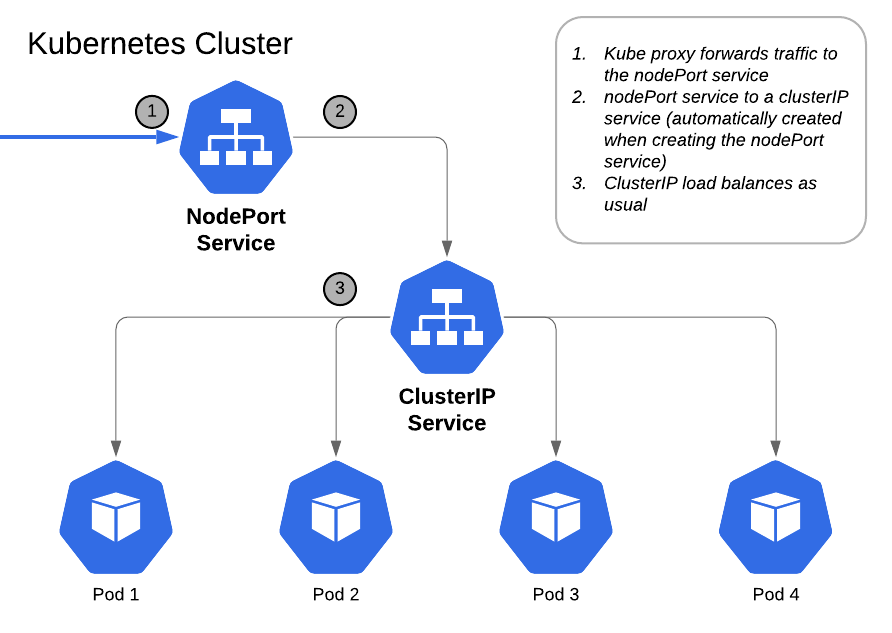

# Kubernetes

## What is kubernetes?
> Kubernetes, also known as K8s, is an open-source system for automating deployment, scaling, and management of containerized applications.
 
## Advantages 
- improve availability and observability i.e. kubernetes consoles (e.g. EKS) provides observability of your Kubernetes clusters so you can identify and resolve issues faster
- can be cheaper than its alternatives
- can improve your productivity
- is a future proof solution; all major cloud vendors are supporting Kubernetes

## Use Cases

## Competitors of K8
- LXC. Canonical
 -   Docker. Docker
 -   Packer. HashiCorp
 -   Red Hat OpenShift. Red Hat
 -   Marathon.
 -   Vagrant. HashiCorp

## Self-managed vs Provider-managed

Considering the requirements, cost, and flexibility of an application.
If we go with the Provider-managed Kubernetes service, we've found that it costs around $100 per month only to manage the cluster.
In contrast, if we choose self-management, do we have the time and expertise to run the Kubernetes cluster? When it comes to flexibility, though, self-managed Kubernetes services have considerably more possibilities.
Finally, take into account your application needs, available time for management duties, and skill level. 

## Clusters

A Kubernetes cluster consists of a collection of nodes that execute containerized apps. The Kubernetes cluster enables the programme to operate on numerous computers and in different settings. 

## commands
- `kubectl`
- `kubectl get service`, `kubectl get services`; `kubectl get services --all-namespaces`

- `kubectl get node`
- `kubectl get deployment`
- `KUBE_EDITOR="code -w" kubectl edit deploy nginx-deployment`
- `kubectl delete pod nginx-deployment-7848d4b86f-67m46`
- `kubectl delete deploy nginx-deployment` and `kubectl delete svc nginx-deployment`
- `kubectl scale deploy sparta-node-app-deploy --replicas=8`