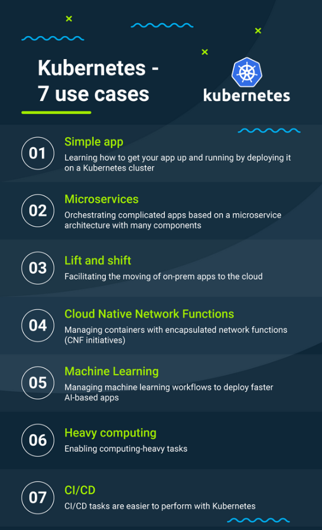

# Kubernetes

## What is kubernetes?
> Kubernetes, also known as K8s, is an open-source system for automating deployment, scaling, and management of containerized applications.
 
## Advantages 
- improve availability and observability
- can be cheaper than its alternatives
- can improve your productivity
- is a future proof solution; all major cloud vendors are supporting Kubernetes

## Use Cases

## Competitors of K8
- LXC. Canonical
 -   Docker. Docker
 -   Packer. HashiCorp
 -   rkt.
 -   Red Hat OpenShift. Red Hat
 -   Marathon.
 -   Vagrant. HashiCorp

